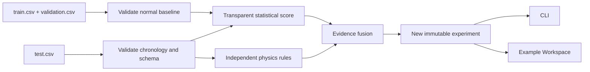

<p align="center">
  
</p>

# PhysGuard-ICS

[](CHANGELOG.md)
[](pyproject.toml)
[](LICENSE)
[](.github/workflows/ci.yml)

PhysGuard-ICS is an offline, physics-aware reference toolkit for transparent anomaly
triage in industrial-control-system telemetry. The public release pairs a simple
normal-only statistical baseline with independent process-consistency rules, preserves
their evidence through four fusion categories, and writes every run to a new immutable
experiment directory.

> This software is a defensive research and education tool. It does not connect to
> controllers, scan networks, send commands, or establish operational safety.

## Features

- Strict validation for chronological train, validation, and test CSV files.
- Normal-only baseline fitting with no test-label leakage.
- Transparent feature z-scores and explicit physics-rule reasons.
- Evidence-preserving categories: `normal`, `ml_only`, `physics_only`, and `hybrid`.
- Collision-resistant experiment IDs and hard overwrite refusal.
- Upload-first Streamlit Example Workspace and a scriptable CLI.
- Entirely artificial, deterministic toy data—no external research dataset included.
- Ruff, MyPy, and pytest checks in GitHub Actions.

## Architecture



See [Architecture](docs/ARCHITECTURE.md) for the persistence model and design boundaries.

## Requirements

- Python 3.11 or newer
- Windows, macOS, or Linux
- A modern browser for the dashboard
- No GPU or network access is required at runtime after installation

## Installation

```bash
git clone https://github.com/Alzayer8/PhysGuard-ICS.git
cd PhysGuard-ICS
python -m venv .venv
```

Activate the environment (`.venv\Scripts\activate` on Windows or
`source .venv/bin/activate` on macOS/Linux), then install:

```bash
python -m pip install --upgrade pip
python -m pip install -e .
```

For development checks:

```bash
python -m pip install -e ".[dev]"
```

Conda users may instead run `conda env create -f environment.yml`.

## Quick start

The included CSV files are synthetic and ready to use:

```bash
physguard doctor
physguard validate \
  --train sample_data/train.csv \
  --validation sample_data/validation.csv \
  --test sample_data/test.csv
physguard analyze \
  --train sample_data/train.csv \
  --validation sample_data/validation.csv \
  --test sample_data/test.csv \
  --workspace example-workspace
```

Each `analyze` invocation creates
`example-workspace/experiments/exp-<UTC>-<random>/`. Supply `--experiment-id my-run` when
you need a stable name; an existing name is rejected.

## Running the dashboard

```bash
python -m streamlit run dashboard/app.py
```

Upload `train.csv`, `validation.csv`, and `test.csv`, then select **Analyze uploaded
data**. The Example Workspace automatically generates a new experiment ID and never
replaces a prior experiment.

## Running the CLI

```bash
physguard --help
physguard validate --help
physguard analyze --help
```

Example with a custom threshold configuration:

```bash
physguard analyze \
  --train /data/train.csv \
  --validation /data/validation.csv \
  --test /data/test.csv \
  --config configs/example.yaml \
  --workspace /analysis/physguard-workspace \
  --experiment-id commissioning-review-001
```

## Preparing a new dataset

Use authorized local telemetry and map it to the columns documented in the
[Dataset Guide](docs/DATASET_GUIDE.md). Train and validation must represent normal
baseline operation. Review units, operating modes, limits, actuator semantics, sampling
intervals, and process topology before adapting `configs/example.yaml`.

To recreate a fresh copy of the toy dataset in an empty directory:

```bash
python scripts/create_sample_data.py --output my-synthetic-data
```

The generator refuses to overwrite existing CSV files.

## Screenshots

| Example Workspace | Evidence table |
|---|---|
| _Placeholder: upload and KPI view_ | _Placeholder: anomaly and physics evidence view_ |

Screenshot placeholders are intentional; replace them after the first hosted release so
they accurately reflect the published dashboard environment.

## Repository layout

```text
.
├── .github/              # CI, issue forms, and contribution templates
├── assets/               # Project logo and GitHub banner
├── configs/              # Public example thresholds
├── dashboard/            # Streamlit Example Workspace
├── docs/                 # Architecture, dataset, authenticity, release report
├── examples/             # Minimal Python invocation
├── physguard/            # Installable public package
├── sample_data/          # Small, entirely synthetic CSV splits
├── scripts/              # Synthetic sample generator
├── tests/                # Public regression tests
├── SHA256SUMS.txt         # Release payload hashes
└── release_manifest.json # release_manifest.json # Integrity inventory and release metadata
```

## Known limitations

- The statistical detector is an intentionally transparent baseline, not a claim of
  state-of-the-art performance.
- Default physics limits describe only the bundled toy tank process.
- Row-wise rules do not model every delay, operating mode, topology, or failure mode.
- Labels, when present, are used only for summary metrics and never for fitting.
- Alerts identify evidence for review; they do not prove malicious activity, root cause,
  process impact, or safety.
- Coordinated sensor compromise can preserve apparent physical relationships.

## Citation

Use the metadata in [CITATION.cff](CITATION.cff). In prose:

> Ahmad Alzayer. *PhysGuard-ICS* (v1.0.0), 2026.

## License

Released under the [Apache License 2.0](LICENSE). See [NOTICE](NOTICE) for attribution.

## Author

Ahmad Alzayer

## Acknowledgements

Thanks to the open-source Python, pandas, NumPy, Streamlit, Plotly, PyYAML, pytest, Ruff,
and MyPy communities. Users remain responsible for authorization, system-specific
engineering review, and safe interpretation of telemetry.
