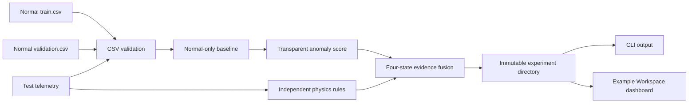

# Architecture

PhysGuard-ICS v1.0.0 is an offline, file-oriented reference toolkit. It does not connect
to controllers, scan networks, or issue process commands.

The statistical branch reports the maximum absolute z-score across four process
features. The independent physics branch reports explicit range and actuator/flow
inconsistencies. Fusion preserves whether evidence was statistical only, physics only,
hybrid, or normal. The implementation is deliberately small enough to audit.

Every run is staged in a private temporary child and renamed into place only after all
outputs have been written. An existing experiment ID causes a hard failure.
